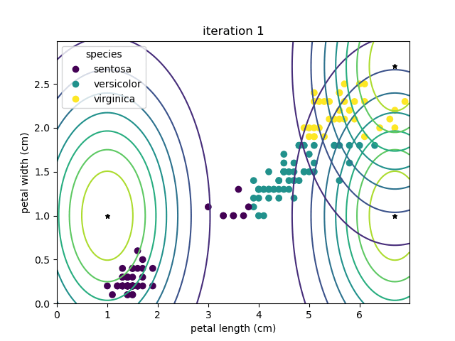

# CISDM-Project
A project on Expectation Maximization and Gaussian Mixture Models, and a demonstration of the Gaussian Mixture Model on the [Iris flower dataset]([https://link-url-here.org](https://en.wikipedia.org/wiki/Iris_flower_data_set)https://en.wikipedia.org/wiki/Iris_flower_data_set). 

